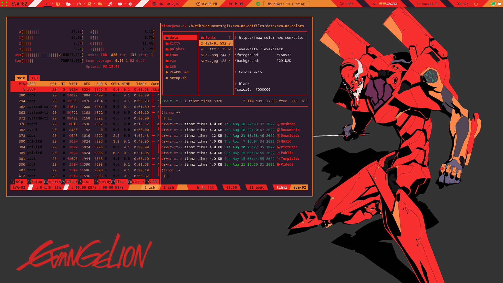

# eva-02-dotfiles

polybar is a modified version of the "blade" theme from :
https://github.com/adi1090x/polybar-themes

tmux theme is a modified version from here :
https://github.com/gpakosz/.tmux.git

```
$ git clone https://github.com/Tihmz/eva-02-dotfiles.git
$ chmod +x setup.sh
$ ./setup.sh --all
```

You can also choose to install each part as you want:
```
$ ./setup zsh vim tmux
```

look like this (*sorry for you eyes*) :



```
OS : Parrot OS
WM : BSPWM
```
